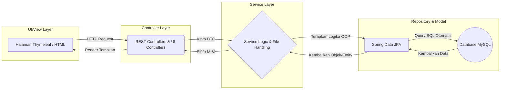
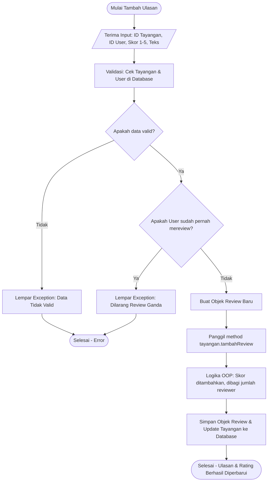

# Absolute Cinema
**Sistem Review & Rating Film Berbasis Object-Oriented Programming (OOP)**

Repositori ini merupakan backend service untuk aplikasi Absolute Cinema. Proyek ini adalah sebuah platform backend API (dengan antarmuka web) yang memungkinkan pengguna untuk mencari tayangan, melihat detail, memberikan rating, menulis ulasan, serta mengelola profil. Proyek ini dirancang khusus untuk memenuhi kriteria dan mendemonstrasikan pemahaman mata kuliah Pemrograman Berorientasi Objek (OOP) menggunakan bahasa Java dan framework Spring Boot.

---

## Fitur Utama
* **Kalkulasi Rating Otomatis:** Perhitungan rata-rata skor tayangan secara real-time menggunakan prinsip enkapsulasi OOP saat ulasan baru masuk.
* **Autentikasi & Keamanan:** Sistem login dan registrasi yang diamankan dengan Spring Security, password hashing (BCrypt), dan verifikasi akun berbasis Email OTP.
* **Manajemen File (Local Storage):** Fitur unggah gambar dengan penamaan unik (UUID) untuk poster tayangan dan foto profil pengguna.
* **Katalog Dinamis:** Pemisahan entitas antara Film dan Serial TV dengan properti dan detail yang spesifik untuk masing-masing jenis tayangan.

---

## Penerapan 4 Pilar OOP
Fokus utama arsitektur sistem ini adalah mendemonstrasikan empat pilar utama OOP:

* **Inheritance:** Class anak seperti `Film` (memiliki atribut durasiMenit) dan `SerialTV` (memiliki atribut jumlahMusim dan totalEpisode) mewarisi atribut dasar dari Abstract Class induk `Tayangan`.
* **Encapsulation:** Semua variabel di-set private. Atribut sensitif seperti totalSkor dan jumlahReviewer tidak bisa diubah langsung dari luar, melainkan harus melalui method internal `tambahReview(int skor)`.
* **Polymorphism:** Penerapan Method Overriding pada fungsi `tampilkanDetail()` yang menghasilkan output informasi yang berbeda untuk objek Film dan SerialTV.
* **Abstraction:** Menggunakan Interface bernama `Rateable` yang memuat kontrak fungsi `hitungRatingRataRata()`.

---

## Tech Stack & Arsitektur
Proyek ini dibangun menggunakan teknologi berikut:
* **Bahasa Pemrograman:** Java
* **Framework Backend:** Spring Boot, Spring Security, Spring Data JPA
* **Database:** MySQL
* **Mail Server:** Java Mail Sender (untuk pengiriman OTP)
* **View Template:** Thymeleaf / HTML

### Arsitektur Sistem Layering
Diagram ini menunjukkan alur data dari Frontend hingga tersimpan ke Database.

---

## Class Diagram Komprehensif
Diagram kelas ini telah disesuaikan untuk mencakup struktur lapisan (layer) arsitektur secara lengkap.

**1. Domain Model (Entity & DTO Layer)**

**2. Business Model (Service & Repository Layer)**

**3. API & Presentation (Controller & Security)**

---

## Alur Logika Sistem (Flowcharts)

### 1. User Journey Utama
Alur dari sudut pandang pengguna saat membuka aplikasi hingga memberikan ulasan.

### 2. Logika Hitung Rating Otomatis (OOP Core)
Alur ini menerapkan enkapsulasi untuk mencegah manipulasi skor secara langsung.

---

## Pembagian Tugas Kelompok (12 Orang)
Tim dibagi menjadi 3 divisi utama untuk memastikan pengembangan yang terstruktur.

| Divisi | Peran | Deskripsi Tugas Utama |
| :--- | :--- | :--- |
| **Backend Core** | Orang 1 | Membuat abstract class `Tayangan`, turunannya, dan interface `Rateable`. |
| | Orang 2 | Membuat entitas `User`, `Review`, dan logika enkapsulasi kalkulasi rating. |
| | Orang 3 | Mengonfigurasi Spring Data JPA dan mendesain relasi entitas. |
| | Orang 4 | Membuat seluruh antarmuka Repository dan custom query. |
| **Service & API** | Orang 5 | Membuat `TayanganService` untuk logika bisnis CRUD katalog film. |
| | Orang 6 | Membuat `ReviewService` untuk logika ulasan dan pembuatan `FileStorageService`. |
| | Orang 7 | Membuat kumpulan Controller untuk API tayangan, ulasan, dan integrasi upload. |
| | Orang 8 | Membuat DTO, konfigurasi Spring Security, dan logika Email OTP. |
| **View & QA** | Orang 9 | Membuat halaman Thymeleaf untuk antarmuka katalog dan detail. |
| | Orang 10 | Membuat antarmuka form interaktif dan halaman autentikasi/profil. |
| | Orang 11 | Membuat Unit Testing untuk validasi logika menggunakan JUnit/Mockito. |
| | Orang 12 | Project Manager, pengelola Git, dan penyusun dokumentasi Swagger. |

---

## Dokumentasi API

Untuk menguji API endpoint secara langsung, sistem ini telah terintegrasi dengan Swagger UI.
* **Swagger UI Endpoint:** `http://localhost:8080/swagger-ui/index.html`
* **OpenAPI Specification:** Silakan lihat file `openapi.yaml` pada direktori root proyek ini.