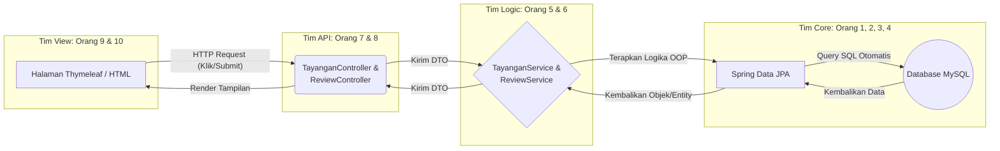
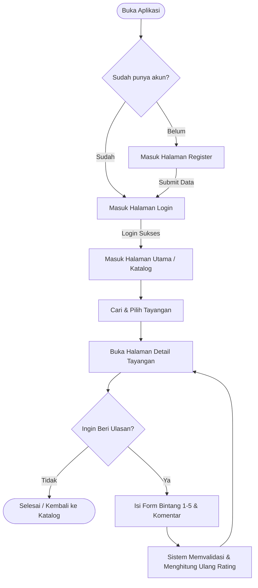

# 🎬 Absolute Cinema
**Sistem Review & Rating Film Berbasis Object-Oriented Programming (OOP)**

Repositori ini merupakan *backend service* untuk aplikasi **Absolute Cinema**. Proyek ini adalah sebuah platform *backend API* (dengan antarmuka Thymeleaf) yang memungkinkan pengguna untuk mencari, melihat detail, memberikan rating, dan menulis ulasan tayangan hiburan. Proyek ini dirancang khusus untuk memenuhi kriteria mata kuliah OOP menggunakan Java dan Spring Boot.

---

## 💡 Penerapan 4 Pilar OOP
Fokus utama sistem ini adalah kalkulasi rating otomatis secara *real-time* saat ulasan masuk, dengan mendemonstrasikan empat pilar OOP:
* **Inheritance:** `Class` anak seperti `Film` (memiliki atribut `durasiMenit`) dan `SerialTV` (memiliki atribut `jumlahMusim` dan `totalEpisode`) mewarisi atribut dari `Abstract Class` induk `Tayangan`.
* **Encapsulation:** Semua variabel di-set `private`. Atribut sensitif seperti `totalSkor` dan `jumlahReviewer` tidak bisa diubah langsung, melainkan melalui *method* internal `tambahReview(int skor)`.
* **Polymorphism:** Penerapan *Method Overriding* pada fungsi `tampilkanDetail()` yang menghasilkan *output* berbeda untuk objek `Film` dan `SerialTV`.
* **Abstraction:** Menggunakan `Interface` bernama `Rateable` yang memuat kontrak fungsi `hitungRatingRataRata()`.

---

## 🛠️ Tech Stack & Arsitektur
Proyek ini dibangun menggunakan:
* **Bahasa Pemrograman:** Java
* **Framework & Interactor:** Spring Boot dan Spring Data JPA
* **Database & Tampilan:** MySQL dan Thymeleaf / HTML

### Arsitektur Sistem Layering
Diagram ini menunjukkan alur data dari *Frontend* hingga tersimpan ke *Backend*.



---

## 📊 Class Diagram Komprehensif
Diagram kelas ini telah disesuaikan untuk mencakup pembagian tugas ke-12 anggota tim, mulai dari Core Model, DTO, Repository, Service Layer, Controller, hingga Security.


---

## 🗺️ Alur Logika Sistem (Flowcharts)

### 1. User Journey Utama
Alur dari sudut pandang *User* saat membuka aplikasi dari awal sampai selesai memberi ulasan.


### 2. Logika Hitung Rating Otomatis (OOP Core)
Alur ini menerapkan enkapsulasi untuk menghitung rata-rata skor saat ulasan baru ditambahkan.


---

## 👥 Pembagian Tugas Kelompok (12 Orang)
Tim dibagi menjadi 3 sub-tim utama: Backend Core, API & Integration, serta Support.

### A. Sub-Tim Backend Core (OOP & Domain Model)
* **Orang 1:** Core Architect - Membuat abstract class `Tayangan`, kelas turunan `Film` dan `SerialTV`, serta interface `Rateable`. 
* **Orang 2:** Domain Specialist - Membuat kelas entitas `User` dan `Review` beserta logika *encapsulation* dan rumus matematika kalkulasi rating.
* **Orang 3:** Database Engineer - Mengonfigurasi Spring Data JPA dan mendesain relasi antar objek (*One-to-Many*, dll).
* **Orang 4:** Repository Layer - Membuat semua antarmuka repository dan *custom query*.

### B. Sub-Tim Service & API (Logic & Controller)
* **Orang 5:** Service Layer (Catalog Logic) - Membuat `TayanganService` beserta implementasinya untuk mengatur logika bisnis CRUD.
* **Orang 6:** Service Layer (Review Logic) - Membuat `ReviewService` untuk logika unggah ulasan dan pencegahan duplikasi.
* **Orang 7:** Controller Layer - Membuat `TayanganController` dan `ReviewController` untuk REST API.
* **Orang 8:** DTO & Security - Membuat Data Transfer Object dan mengonfigurasi Spring Security.

### C. Sub-Tim View & Integrasi, Testing, & DevOps
* **Orang 9:** UI Developer (Katalog & Detail) - Membuat halaman HTML/Thymeleaf untuk daftar dan detail film.
* **Orang 10:** UI Developer (Form & Auth) - Membuat halaman form review dan visual login/register.
* **Orang 11:** Quality Assurance - Membuat Unit Testing menggunakan JUnit/Mockito.
* **Orang 12:** Project Manager - Mengatur Git, dokumentasi Swagger, dan menyusun materi presentasi.
````</Configuration></RestController></RestController></Service></Service></DTO></DTO></DTO>

---
## 📚 API Documentation

Swagger UI:
http://localhost:8080/swagger-ui/index.html

OpenAPI Specification:
Lihat `openapi.yaml` di project root.
