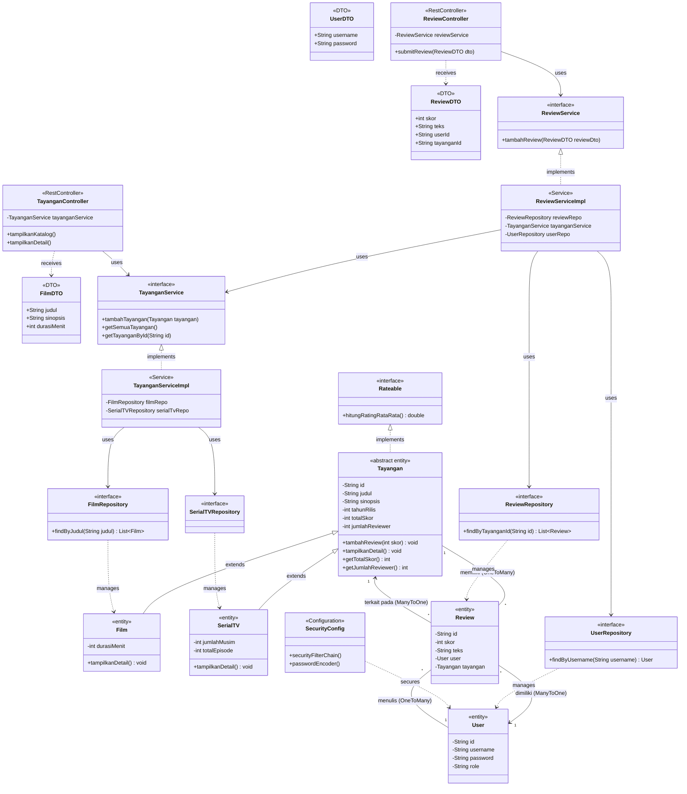

# Class Diagram Proyek Absolute Cinema

Diagram kelas berikut memvisualisasikan struktur dan arsitektur sistem proyek **Absolute Cinema**. Diagram ini telah disesuaikan secara komprehensif untuk mencakup pembagian tugas ke-12 anggota tim, mulai dari **Core Model**, **DTO**, **Repository (JPA)**, **Service Layer (Interface & Impl)**, **Controller**, hingga **Security**.

## Penjelasan Kelengkapan Sesuai Pembagian Tugas (12 Orang)

1. **Orang 1 (Core Architect)**: Sudah lengkap dengan `Tayangan` (Abstract), `Film`, `SerialTV`, dan `Rateable` (Interface).
2. **Orang 2 (Domain Specialist)**: Tersedia entitas `User` dan `Review`. Sifat *encapsulation* terlihat melalui modifier akses atribut yang bersifat `private` dan setter validasinya.
3. **Orang 3 (Database Engineer)**: Relasi relasional JPA digambarkan dengan asosiasi **OneToMany** dan **ManyToOne** di bagian entitas `User`, `Tayangan`, dan `Review`.
4. **Orang 4 (Repository Layer)**: Tersedia blok *Repository Layer* berupa interface `UserRepository`, `ReviewRepository`, `FilmRepository`, dan `SerialTVRepository`.
5. **Orang 5 (Service - Catalog)**: Pola *dependency injection* yang direpresentasikan oleh *Interface* `TayanganService` dan implementasinya `TayanganServiceImpl`.
6. **Orang 6 (Service - Review)**: Hal yang sama diterapkan pada *Interface* `ReviewService` dan implementasinya `ReviewServiceImpl`.
7. **Orang 7 (Controller Layer)**: Tersedia blok untuk `TayanganController` dan `ReviewController`.
8. **Orang 8 (DTO & Security)**: Telah ditambahkan layer `DTO` (`FilmDTO`, `ReviewDTO`, `UserDTO`) dan komponen konfigurasi keamanan dasar, `SecurityConfig`.
9. **Orang 9 & 10 (UI Developer)**: Halaman statis HTML (contoh: `catalog.html`, `login.html`) tidak divisualisasikan dalam *Class Diagram Back-End Java*, karena UI/Frontend HTML secara teknis bukanlah Class di Java, namun fungsinya direpresentasikan sebagai klien/konsumen dari *Controller*.
10. **Orang 11 & 12 (QA, PM, Documenter)**: Sama seperti poin di atas, file Test Unit (`TayanganServiceTest.java`) dan dokumentasi (`README.md`, slide UAS) tidak masuk struktur OOP Class Diagram murni, namun mereka akan bekerja secara eksternal dari arsitektur diagram di atas.
