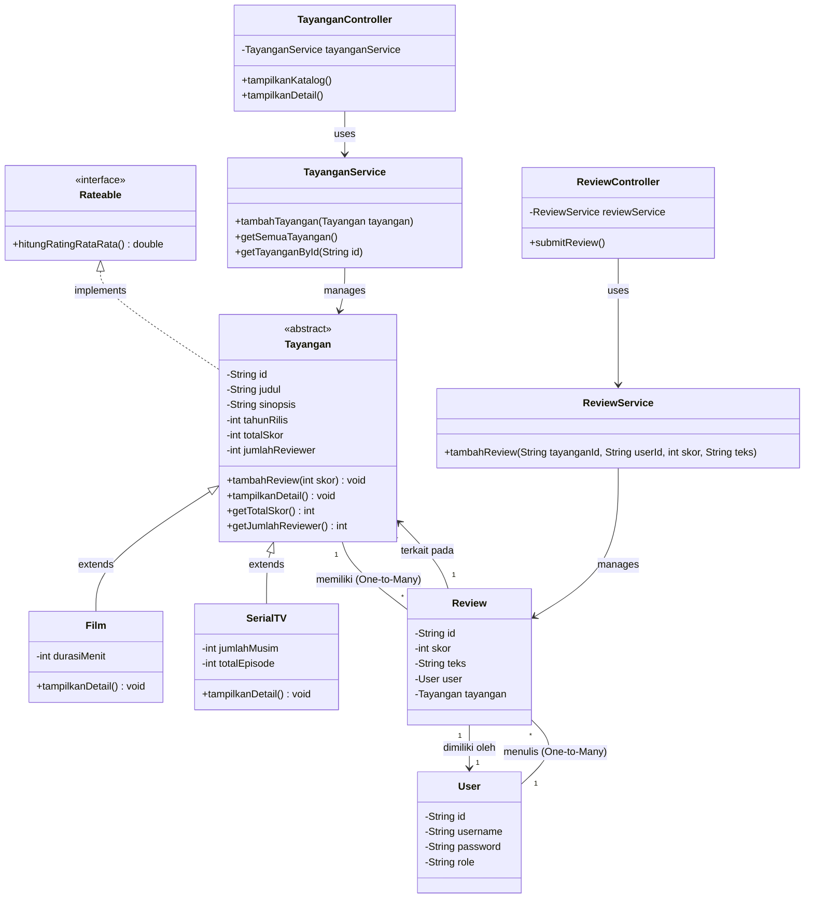

# Class Diagram Proyek Absolute Cinema

Diagram kelas berikut memvisualisasikan struktur dan arsitektur sistem proyek **Absolute Cinema** berdasarkan spesifikasi proyek dan penerapan pilar-pilar Pemrograman Berorientasi Objek (OOP) yang meliputi **Inheritance**, **Encapsulation**, **Polymorphism**, dan **Abstraction**.

## Penjelasan Singkat (4 Pilar OOP):
1. **Inheritance**: `Film` dan `SerialTV` mewarisi atribut dan perilaku dari *abstract class* `Tayangan`.
2. **Encapsulation**: Atribut yang bersifat *sensitive* (seperti `totalSkor` dan `jumlahReviewer`) diakses melalui mekanisme yang aman seperti *method* `tambahReview(int skor)` dan *getter*. Atribut-atribut juga dilindungi dengan modifier `private`.
3. **Polymorphism**: *Method Overriding* terjadi pada fungsi `tampilkanDetail()`. `Film` akan menampilkan durasi, sedangkan `SerialTV` akan menampilkan season/episode.
4. **Abstraction**: `Tayangan` mengimplementasikan *interface* `Rateable` untuk menjamin adanya fungsi standard komputasi rating (`hitungRatingRataRata()`).
